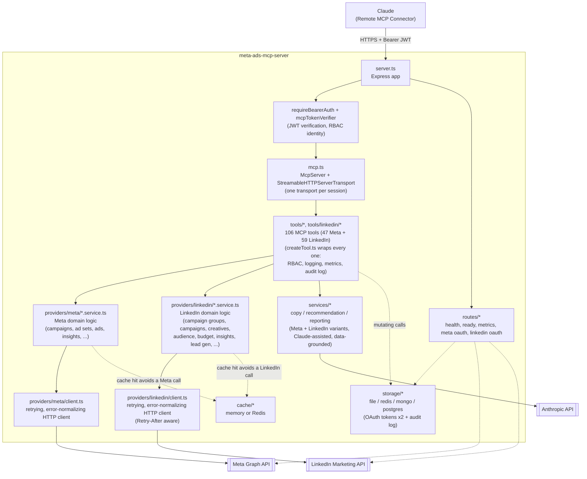

# Architecture

## Component overview

## Layering and why

**`tools/` stays thin.** Every tool file (`campaigns.tools.ts`, `ai.tools.ts`, their `tools/linkedin/*` counterparts, etc.) parses input with Zod, resolves a `connectionKey`, and calls straight into either a provider's domain-service function or an AI service function. All cross-cutting concerns — RBAC enforcement, structured logging, Prometheus metrics, audit trail writes, and normalizing both success and thrown errors into the MCP result shape — live in one place: `tools/createTool.ts`. Every tool (Meta and LinkedIn alike) is built by wrapping a plain async handler in `createTool()`, so none of that logic is duplicated 106 times. `createTool.ts` classifies both `MetaApiError` and `LinkedInApiError` the same way when deciding what's worth alerting Sentry on.

**Two platforms, two contracts, one shared foundation.** `types/provider.types.ts`'s `AdProvider` is shaped around Meta's Account → Campaign → AdSet → Ad hierarchy; `providers/meta/meta.provider.ts` is its only implementation, built from nine domain services under `providers/meta/`. LinkedIn's domain model (Organization → Ad Account → Campaign Group → Campaign → Creative, plus native Lead Gen Forms) doesn't map onto that same interface without distortion, so it gets its own `LinkedInAdProvider` contract in `types/linkedin-provider.types.ts`, backed by eight domain services under `providers/linkedin/`. Every method on both interfaces takes `connectionKey` first, since a single deployment can hold multiple connections per platform (multiple Business Managers or organizations, or a personal account) — see `auth/tokenManager.ts` (Meta) and `auth/linkedinTokenManager.ts` (LinkedIn). `tools/linkedin/*.tools.ts` call the LinkedIn services directly, the same way `tools/campaigns.tools.ts` calls `metaProvider` directly — neither goes through `provider.registry.ts`'s `getProvider()`, which is a documented extension point for a future generic-by-name lookup, not something either provider's own tools need today. `providers/google/` and `providers/tiktok/` remain extension-point READMEs (no fake classes) for adding another platform later.

**Every LinkedIn tool name is prefixed to avoid collision.** Both platforms expose overlapping concepts (list ad accounts, create/pause/resume a campaign, upload media, update a budget) under this one MCP server. Every `linkedin_*` tool name carries that prefix specifically so `list_ad_accounts` (Meta) and `linkedin_list_ad_accounts` (LinkedIn) can never collide in the MCP tool registry.

**AI logic is data-grounded, not a black box.** `services/recommendation.service.ts` / `services/linkedinRecommendation.service.ts`'s budget/bid recommendations and the corresponding reporting services' reports all take real insights data fetched via the provider — the AI reasons over actual account performance, not a blind prompt. `campaign_health_score` (both platforms) computes its numeric score with a deterministic formula in plain TypeScript (CTR/frequency/CPA for Meta; CTR/click-to-lead-conversion/CPL for LinkedIn, reflecting its typically lower CTR and lead-gen-centric objectives) — the AI only writes the narrative on top of an already-computed, reproducible number. LinkedIn's `creative_score` applies the same pattern to a creative's structural quality (commentary length, headline, CTA, landing page scheme).

**Storage and cache are swappable by config, not code.** `storage/storage.factory.ts` and `cache/cache.factory.ts` each pick a concrete implementation from an env var (`STORAGE_BACKEND`, `CACHE_BACKEND`) behind a single interface (`StorageAdapter`, `CacheAdapter`). `auth/tokenManager.ts` / `auth/linkedinTokenManager.ts` (OAuth tokens, one storage namespace each) and `middleware/auditLogger.ts` (shared audit trail) depend only on `StorageAdapter`; both providers' services depend only on `CacheAdapter`. Swapping `file` → `redis` in production is an env change.

**Sessions are per-connection, not shared.** `mcp.ts`'s `createMcpServer()` builds a fresh `McpServer` (all 106 tools registered) for every new MCP session; `server.ts` keeps a `Map<sessionId, StreamableHTTPServerTransport>` following the pattern the MCP SDK documents. RBAC identity (`userId`, `role`) comes from the bearer JWT via `auth/mcpTokenVerifier.ts`, which adapts our own JWT verification (`auth/jwt.ts`) to the SDK's `OAuthTokenVerifier` contract so `requireBearerAuth` can protect `/mcp` directly.

## Directory map

| Path | Responsibility |
|---|---|
| `src/server.ts` | Express app: security middleware, `/mcp` session routing, mounts `routes/*` |
| `src/mcp.ts` | Builds an `McpServer` with all tools registered; maps `AuthInfo` → RBAC context |
| `src/config/` | Env validation (Zod), constants (Meta + LinkedIn), RBAC role→tool matrix |
| `src/types/` | Shared domain types; the `AdProvider`/`LinkedInAdProvider` and `StorageAdapter` contracts |
| `src/providers/` | `AdProvider`/`LinkedInAdProvider` interfaces + registry; `meta/` and `linkedin/` implementations; extension-point READMEs for other platforms |
| `src/services/` | AI service layer (Claude-assisted copy/recommendations/reporting, Meta + LinkedIn variants) |
| `src/storage/`, `src/cache/` | Swappable persistence and caching behind one interface each |
| `src/auth/` | Meta OAuth flow + LinkedIn OAuth flow, token refresh (both), JWT issuance/verification, RBAC checks |
| `src/tools/`, `src/tools/linkedin/` | All 106 MCP tool definitions + the `createTool()` wrapper they're all built from |
| `src/middleware/` | Rate limiting, request logging, audit logging, HMAC request signing, error normalization |
| `src/observability/` | Prometheus metrics (Meta + LinkedIn), OpenTelemetry preload, gated Sentry |
| `src/routes/` | The small REST surface: health/ready/metrics/Meta OAuth/LinkedIn OAuth |
| `tests/` | Vitest unit + integration suite (Meta and LinkedIn APIs both mocked via MSW; own app driven via supertest) |

See [sequence-diagrams.md](./sequence-diagrams.md) for the OAuth, tool-call, and bulk-operation flows, and [mcp-tools.md](./mcp-tools.md) for the full tool reference.
