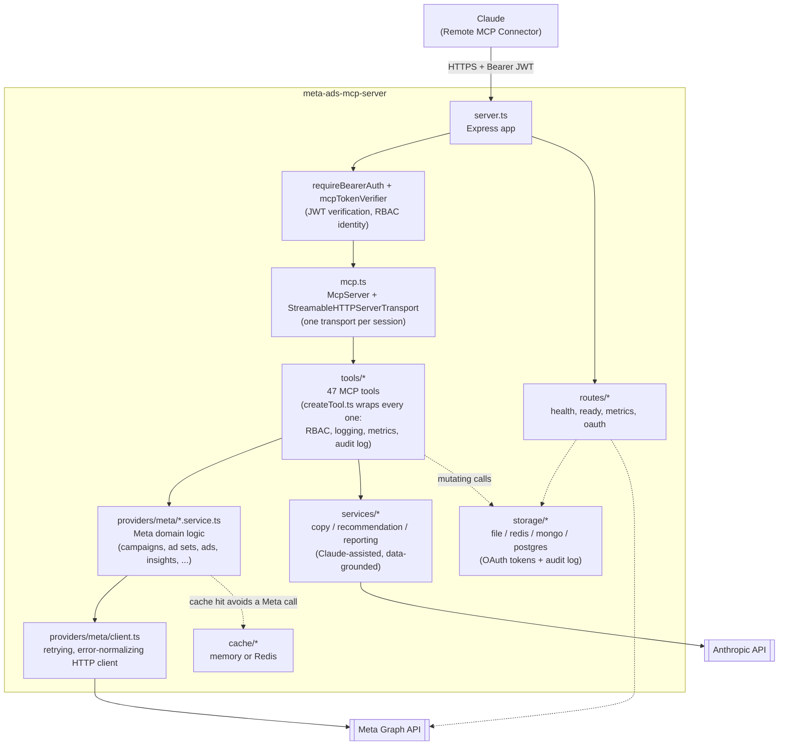

# Architecture

## Component overview

## Layering and why

**`tools/` stays thin.** Every tool file (`campaigns.tools.ts`, `ai.tools.ts`, etc.) parses input with Zod, resolves a `connectionKey`, and calls straight into either a Meta provider method or an AI service function. All cross-cutting concerns — RBAC enforcement, structured logging, Prometheus metrics, audit trail writes, and normalizing both success and thrown errors into the MCP result shape — live in one place: `tools/createTool.ts`. Every tool is built by wrapping a plain async handler in `createTool()`, so none of that logic is duplicated 47 times.

**Meta access goes through one interface.** `types/provider.types.ts` defines `AdProvider` — a provider-agnostic contract (`listCampaigns`, `createCampaign`, `getInsights`, ...). `providers/meta/meta.provider.ts` is the only implementation today, built from nine domain services under `providers/meta/`. Every `AdProvider` method takes `connectionKey` first, since a single deployment can hold multiple Meta connections (multiple Business Managers, or one personal account) — see `auth/tokenManager.ts`. `providers/google/`, `providers/linkedin/`, and `providers/tiktok/` are documented extension points (a README each, not fake classes) for adding another platform later without touching `tools/`.

**AI logic is data-grounded, not a black box.** `services/recommendation.service.ts`'s budget/bid recommendations and `services/reporting.service.ts`'s reports all take real `MetaInsightsRow[]` data fetched via the provider — the AI reasons over actual account performance, not a blind prompt. `campaign_health_score`'s numeric score is computed by a deterministic formula (CTR/frequency/CPA weighting) in plain TypeScript; the AI only writes the narrative on top of an already-computed, reproducible number.

**Storage and cache are swappable by config, not code.** `storage/storage.factory.ts` and `cache/cache.factory.ts` each pick a concrete implementation from an env var (`STORAGE_BACKEND`, `CACHE_BACKEND`) behind a single interface (`StorageAdapter`, `CacheAdapter`). `auth/tokenManager.ts` (OAuth tokens) and `middleware/auditLogger.ts` (audit trail) depend only on `StorageAdapter`; the Meta provider services depend only on `CacheAdapter`. Swapping `file` → `redis` in production is an env change.

**Sessions are per-connection, not shared.** `mcp.ts`'s `createMcpServer()` builds a fresh `McpServer` (all 47 tools registered) for every new MCP session; `server.ts` keeps a `Map<sessionId, StreamableHTTPServerTransport>` following the pattern the MCP SDK documents. RBAC identity (`userId`, `role`) comes from the bearer JWT via `auth/mcpTokenVerifier.ts`, which adapts our own JWT verification (`auth/jwt.ts`) to the SDK's `OAuthTokenVerifier` contract so `requireBearerAuth` can protect `/mcp` directly.

## Directory map

| Path | Responsibility |
|---|---|
| `src/server.ts` | Express app: security middleware, `/mcp` session routing, mounts `routes/*` |
| `src/mcp.ts` | Builds an `McpServer` with all tools registered; maps `AuthInfo` → RBAC context |
| `src/config/` | Env validation (Zod), constants, RBAC role→tool matrix |
| `src/types/` | Shared domain types, the `AdProvider` and `StorageAdapter` contracts |
| `src/providers/` | `AdProvider` interface + registry; `meta/` implementation; extension-point READMEs for other platforms |
| `src/services/` | AI service layer (Claude-assisted copy/recommendations/reporting) |
| `src/storage/`, `src/cache/` | Swappable persistence and caching behind one interface each |
| `src/auth/` | Meta OAuth flow, token refresh, JWT issuance/verification, RBAC checks |
| `src/tools/` | All 47 MCP tool definitions + the `createTool()` wrapper they're all built from |
| `src/middleware/` | Rate limiting, request logging, audit logging, HMAC request signing, error normalization |
| `src/observability/` | Prometheus metrics, OpenTelemetry preload, gated Sentry |
| `src/routes/` | The small REST surface: health/ready/metrics/OAuth |
| `tests/` | Vitest unit + integration suite (Meta API mocked via MSW; own app driven via supertest) |

See [sequence-diagrams.md](./sequence-diagrams.md) for the OAuth, tool-call, and bulk-operation flows, and [mcp-tools.md](./mcp-tools.md) for the full tool reference.
