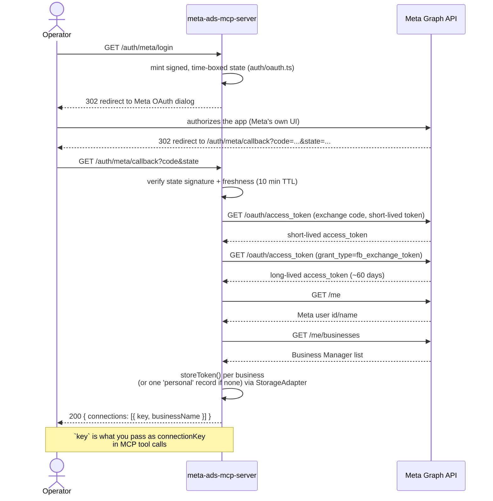
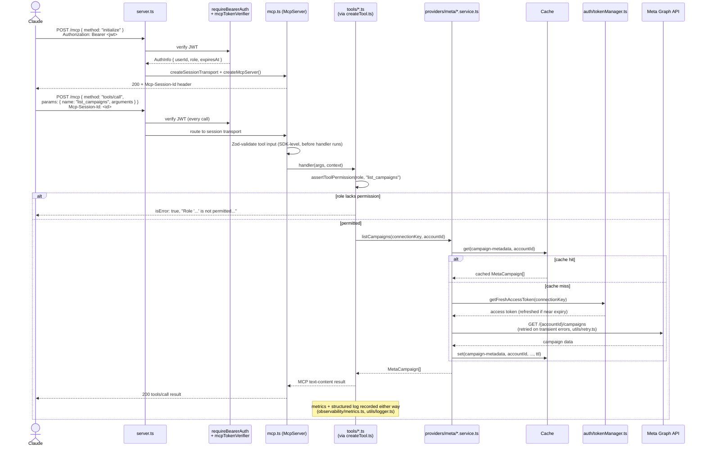
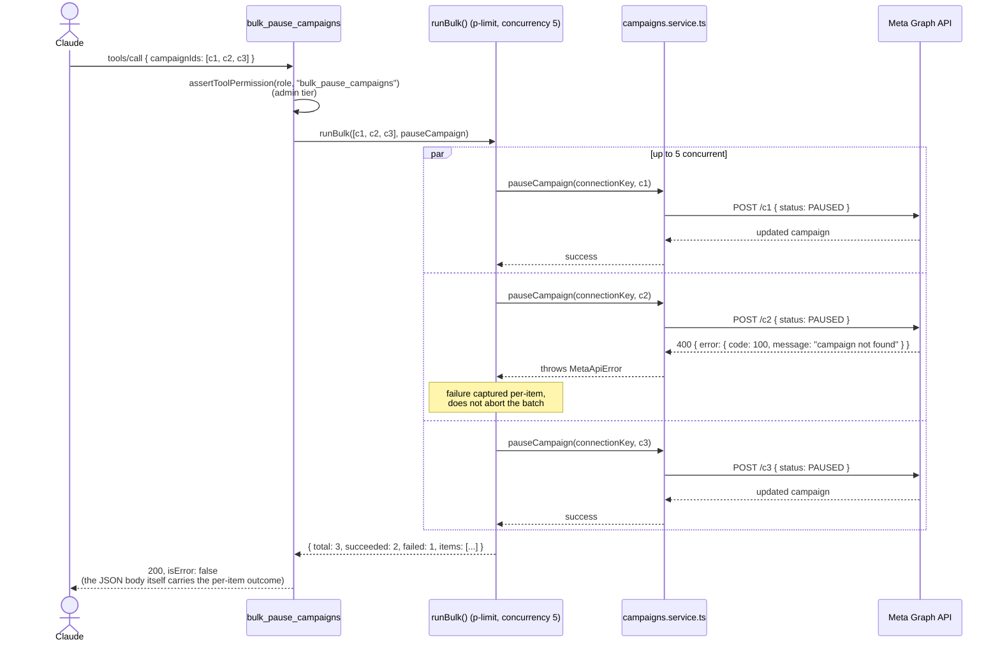

# Sequence Diagrams

## 1. Meta OAuth connection flow

The operator visits `/auth/meta/login` once (in a browser, not via Claude) to connect their Meta account. This mints the `connectionKey` value(s) later passed into MCP tool calls.

## 2. MCP tool-call flow (Claude → Meta API)

## 3. Bulk operation flow

`bulk_pause_campaigns` shown; `bulk_resume_campaigns`, `bulk_update_budgets`, `bulk_update_target_audience`, and `bulk_create_ads` all follow the same shape (`tools/bulk.util.ts`).

See [architecture.md](./architecture.md) for the component-level view and [mcp-tools.md](./mcp-tools.md) for the full tool reference.
